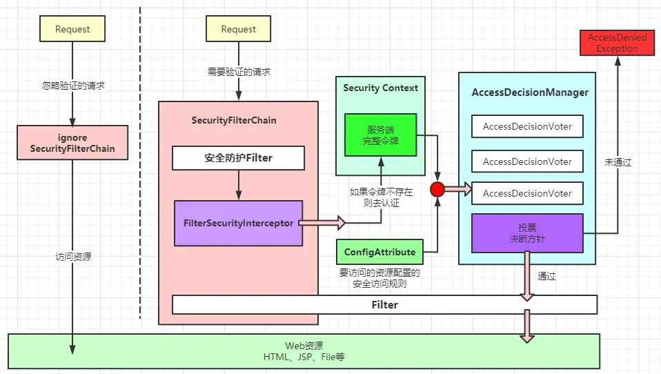

AbstractUserDetailsAuthenticationProvider
MessageSourceAware 国际化相关的接口
public class DemoBean implements MessageSourceAware {
    private MessageSource messageSource;
    @Override
    public void setMessageSource(MessageSource messageSource) {
        ReloadableResourceBundleMessageSource bundleSource = new ReloadableResourceBundleMessageSource();
        bundleSource.setBasename("messages");
        this.messageSource = bundleSource;
    }
    public void printMessage() {
        String code = "msg";
        Object[] args = new Object[]{"cheney"};
        Locale locale = new Locale("en", "US");
        String msg = messageSource.getMessage(code, args, locale);
        System.out.println(msg);
    }
}

PathPattern，AntPathMatcher

我们知道/**和/{*pathVariable}都有匹配剩余所有path的“能力”，那它俩到底有什么区别呢?

/**能匹配成功，但无法获取到动态成功匹配元素的值
/{*pathVariable}可认为是/**的加强版：可以获取到这部分动态匹配成功的值
正所谓一代更比一代强嘛，如是而已。

和**的优先级关系
既然/**和/{*pathVariable}都有匹配剩余path的能力，那么它俩若放在一起，优先级关系是怎样的呢?
结论：当二者同时出现(出现冲突)时，/**优先匹配。

ConfigAttribute
AccessDecisionVoter

